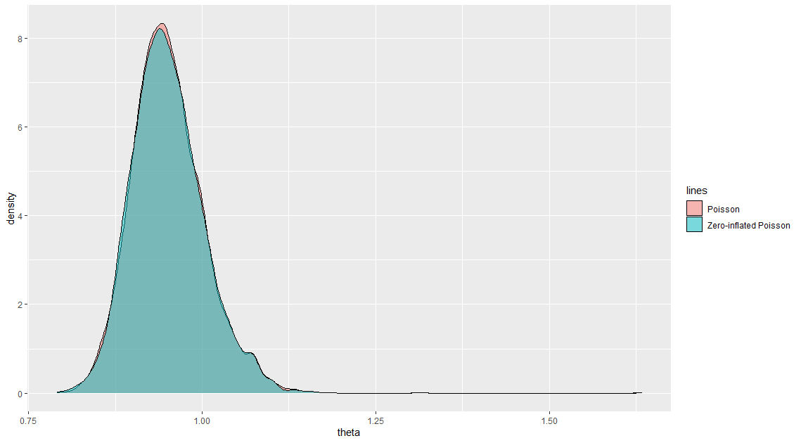
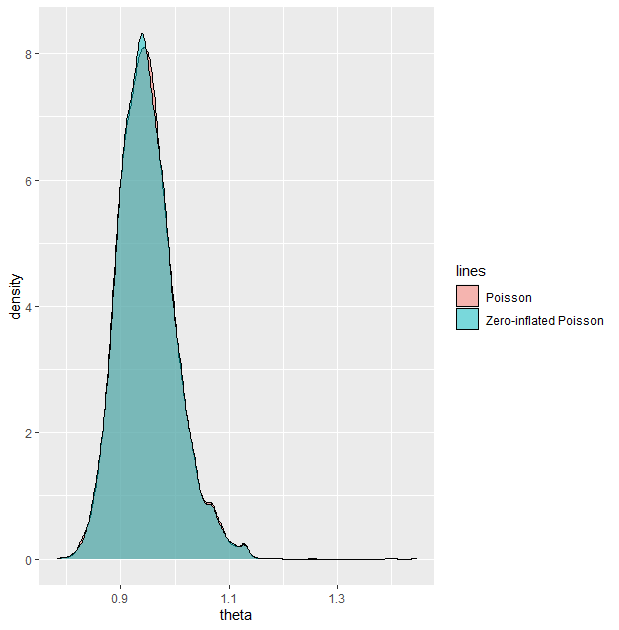
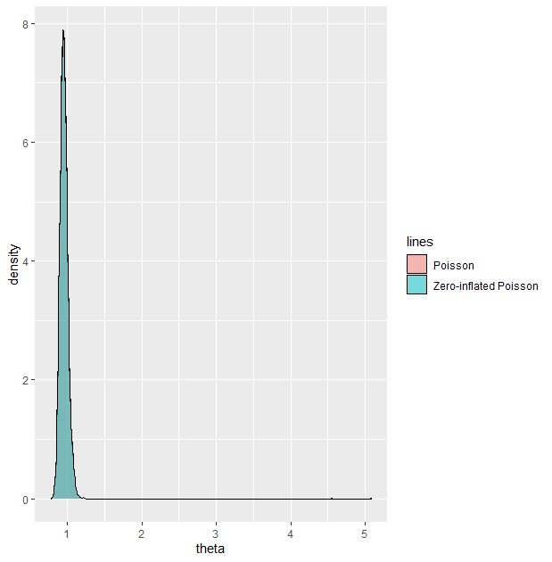
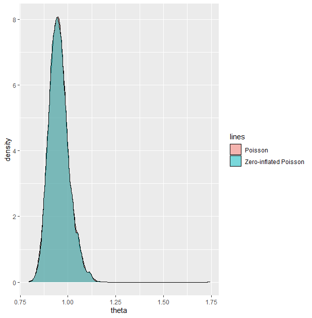

```{r setup, include=FALSE}
knitr::opts_chunk$set(echo = TRUE)
```


# Introduction

The Poisson distribution is a discrete probability distribution used to model the number of events that occur in a given time interval. This distribution is commonly used in many fields of science, engineering, and medicine. Therefore, accurate estimations of Poisson parameters can be very important as minor imprecisions can result in greatly different outcomes in its applications.
In the paper “Bayesian and Non-Bayesian Interval Estimators for the Poisson Mean”, Nadarajah and colleagues compared various estimators for the Poisson mean. The novelty of this paper originated from its unique comparison of various classical interval estimators with Bayesian credible interval estimators using simulation and real-life data. Through such, the authors provide a comprehensive evaluation of the various Poisson mean estimators. Unlike previous papers, the inclusion of Bayesian estimators is especially important for future applications of the Poisson distribution which involve strong prior information. In order to better understand the context of our report, we have summarized Nadarajah's and colleagues' paper. 

Although many classical interval estimators such as the score (SC) interval, Wald (WA) interval, exact (EX) interval interval, and bootstrap (Boot) confidence interval were discussed in the paper, the Bayesian credible estimators were most relevant to the contents of STATS 619 and our entire report. Hence only an overview of the various Bayesian credible intervals was discussed in detail in this introduction. However, as the classical interval estimators were a significant part of the author's study, their results were included in summary, and the respective methods were further introduced in section 3 of the report where they were implemented. 

## Bayesian priors

As Bayesian inference is heavily dependent on the prior distributions used, the paper included various informative and non-informative prior distributions for the derivation of the posterior distributions. These prior distributions included the uniform prior, Jeffreys prior, exponential prior, gamma prior, and chi-square prior. Below the prior distributions and their resulting posterior distributions for a random sample $X_i$ from $Poisson(\lambda)$ are shown. These findings were used in the analysis downstream involving the interval estimators.

### Uniform prior
With the uniform prior $P(\lambda) \propto 1$ with $\lambda > 0$, the posterior distribution we obtain is Gamma($\sum_{i=1}^{n} x_i + 1, n$) 

### Jeffreys prior
With the Jeffreys prior $P(\lambda) \propto \lambda^{-1/2}$ with $\lambda > 0$, the posterior distribution we obtain is Gamma($\sum_{i=1}^{n} x_i + 1/2, n$) 

### Exponential prior
With the exponential prior $P(\lambda) \propto ae^{-a\lambda}$ with $\lambda > 0$ and $a > 0$, the posterior distribution we obtain is Gamma($\sum_{i=1}^{n} x_i + 1, n+a$) 

### Gamma prior
With the gamma conjugate prior $P(\lambda) \propto \lambda^{b-1} e^{-a\lambda}$ with $\lambda > 0$, $a > 0$, and $b>0$, the posterior distribution we obtain is Gamma($\sum_{i=1}^{n} x_i + b, n+a$) 

### Chi-square prior
With the chi-square prior $P(\lambda) \propto \lambda^{b/2-1} e^{-\lambda/2}$ with $\lambda > 0$ and $b>0$, the posterior distribution we obtain is Gamma($\sum_{i=1}^{n} x_i + b/2, n+1/2$)

## Bayesian credible intervals
With the previously derived posterior distributions above, various Bayesian credible intervals were utilized in the paper including the Equal (EQ) tails credible interval, Jeffreys (Jef) prior credible interval, Highest Posterior Density (HPD) credible interval, and Relative surprise (RS) credible interval. The use of the Bayesian posterior distributions in each credible interval allows for changes in belief due to previously known information which is a key difference between the Bayesian credible intervals and the classical interval estimators. Below the Bayesian credible intervals are introduced:

### Equal tails credible interval
Given a $1-\alpha$ interval, the probability of being below or above the equal tails interval is the same ($\alpha/2$). Accordingly, the bounds of the interval are $[\theta_{\alpha/2}, \theta_{1-\alpha/2}]$ where $P(\theta \in [\theta_{\alpha/2}, \theta_{1-\alpha/2}] | \theta) = 1- \alpha$.  

### Jeffreys prior credible interval
Unlike the other intervals, the Jeffreys prior credible interval only depends on the Jeffreys prior $(I(\mu)^{1/2})$ which the authors in the paper claim to be:
$$
I^{1/2}(\mu) = n^{1/2}(\mu+b\mu^2)^{-1/2}
$$
where n is the number of observations. Using this, the authors denote the Jeffreys credible interval for $\mu$ as $(J_\alpha, J_{1-\alpha})$ where $J_\alpha$ and $J_{1-\alpha}$ are the quantiles in the posterior distribution of $\mu$. However this same interval can be determined from the determining the quantiles in the posterior distribution obtained with the Jeffreys prior. 

### HPD credible interval
The highest posterior density is the set $\{\theta : P(\theta|x) \ge k\}$ such that 
$$
1-\alpha = \int_{\{\theta : P(\theta|x) \ge k\}} P(\theta | x) d\theta
$$
In an unimodal distribution like the Poisson distribution, the HPD becomes an interval $(\theta_a, \theta_b)$ such that 
$$
P(\theta_a|x) = P(\theta_b|x)
$$
$$
\int_{\theta_a}^{\theta_b} P(\theta|x)d\theta = 1-\alpha
$$

### Relative surprise credible interval
Given the null hypothesis $H_0: \theta = \theta_0$ the relative surprise credible set is defined as the following:
$$
P(\frac {P(\theta|x)}{P(\theta)} > \frac {P(\theta_0|x)} {P(\theta_0)}) \le 1-\alpha
$$
In a unimodal distribution, this becomes an interval $(\theta_a, \theta_b)$ such that 
$$
\frac {P(theta_a|x)} {P(theta)} = \frac {P(theta_b|x)} {P(\theta)} \\
\int_{\theta_a}^{\theta_b} P(\theta|x) d\theta = 1-\alpha
$$

## Comparison of intervals using simulation and real data application:
The authors performed comparison using simulation by contrasting coverage probabilities and coverage length of the various classical and Bayesian credible intervals. The authors described that ten thousand replications were used to compute the coverage probabilities and coverage length, a five percent level of significance, and arbitrary hyperparameters were used in the simulation analysis. However, no specific data or computational code was provided by the authors. The highlights of the results for the coverage probabilities from the simulation analysis are summarized below. The authors only provided vague descriptions of their comparison and so their exact depictions were included in the table below. 

Table 1: Summary of coverage probability trends in simulation

Estimator                           | Coverage probability                    
------------------------------------|------------------------------------------------
Wald                                |“Acceptably close to nominal level”
Score                               |“Acceptably close to nominal level”
Exact                               |“Acceptably close to nominal level”
Bootstrap                           |“Unacceptably further away from nominal level”
Equal tails (uniform prior)         |“Acceptably close to nominal level”
Equal tails (other priors)          |“Unacceptably further away from nominal level”
Jeffreys prior                      |“Acceptably close to nominal level”
HPD (uniform prior)                 |“Acceptably close to nominal level”
HPD (other prior)                   |“Unacceptably further away from nominal level”
Relative surprise (uniform prior)   |“Unacceptably further away from nominal level”
Relative surprise (other prior)     |“Unacceptably further away from nominal level”

In addition to the information in the table, the authors also generally found that the equal tails credible interval with a uniform prior generally underestimated coverage probability, the Bootstrap interval generally underestimated the coverage probability, and the relative surprise interval generally overestimated the coverage probability.

In terms of coverage length, the researchers found that they typically increased with greater $\lambda$ values, and typically decreased when the n increased except for the HPD and relative surprise credible intervals which also coincidentally had the greatest coverage lengths. 

Following the use of simulation, the authors also performed analysis using data from “Flying-Bomb Hits in London During World War II”[1]. The data was collected from 576 different $1km^2$ regions in London, England during World War II. 

Table 2: Flying-Bomb Hits in London During World War II

Hit     |  0  |  1  |  2 |  3 | 4 | 5+ 
--------|-----|-----|----|----|---|---
Observed| 229 | 211 | 93 | 35 | 7 | 1

During that time frame, a total of 537 bomb hits were recorded, yielding an average of 0.93 hits per region. This value was very close to the Poisson mean obtained by the authors when fitting the data to a Poisson distribution as shown by the interval estimators computed for the Poisson mean. Similar to the previous simulation study, the author's results showed that the coverage lengths were smallest for the exact interval estimator followed by the equal tails credible interval, score interval and Jeffreys prior credible interval. Once again, no details of the procedure were provided. The interval estimator results were summarized by authors in their table below. 

Table 3: Bayesian and non-Bayesian confidence intervals for the mean number of hits

Interval        |Lower bound        |Upper bound        |Upper - Lower
----------------|-------------------|-------------------|-----------------------
WA              |0.85338            |1.01093            |0.15755
SC              |0.85011            |1.00752            |0.15741
EX              |0.85343            |1.00916            |0.15573
Jeffreys        |0.8526             |1.01006            |0.15746
Bootstrap       |0.84375            |1.01215            |0.1684
HPD.u           |0.46441            |1.39323            |0.92882
RS.u            |0.46441            |1.39323            |0.92882
EQ.u            |0.85343            |1.01097            |0.15754
HPD.e           |0.46441            |1.39323            |0.92882
RS.e            |0.46441            |1.39323            |0.92882
EQ.e            |0.85048            |1.00747            |0.15699
HPD.g           |0.46441            |1.39323            |0.92882
RS.g            |0.46441            |1.39323            |0.92882
EQ.g            |0.85379            |1.01107            |0.15728
HPD.c           |0.46441            |1.39323            |0.92882
RS.c            |0.46441            |1.39323            |0.92882
EQ.c            |0.85352            |1.01099            |0.15747

## Conclusion
Ultimately, the authors in the paper found that there results from the simulation and real-data application were consistent. Consequently, the authors made several vague recommendations involving the Poisson mean estimators. The authors proposed the following:

- the best Bayesian credible interval in terms of coverage probability is the Jeffreys prior credible interval
- the best Bayesian credible interval in terms of coverage length are the Jeffreys prior credible interval and the equal tails credible interval
- the best classical interval estimators in terms of coverage probability are the Wald interval, score interval and exact interval estimator
- the best classical interval estimators in terms of coverage length are the Wald interval, score interval, exact interval and bootstrap interval

Although the results from the paper were enlightening to see, we found that the paper was incomplete in a few aspects. First, the results lacked reproductivity and credibility due to the failure to provide concrete results and a specific methodology. Next, the authors also mentioned that they fitted the data with negative binomial and geometric distributions, however no results or further discussion of the procedure were provided. Undoubtedly, it would be very interesting to see how the estimators fare for other commonly used standard distributions such as the negative-binomial and binomial distributions. Finally, we also found that the real-life data used in the paper had an excess number of zeros which would render zero-inflated distributions particularly useful to fit the data. However, the authors do not mention anything in regard to zero-inflated distributions.
Accordingly, our goal in this report is to reproduce the results in the study for the real-data application to verify the findings of the study. We would also like to extend the estimator comparison to the binomial and negative-binomial distributions as these are also widely applicable in various fields of science, engineering, and medicine. Finally, we would also like to investigate the Bayesian credible intervals in zero-inflated distributions as we believe this would more accurately model the World War II bomb data and is often overlooked for many cases in which the data has an excess number of zeros. The data used and methods employed in our analysis were discussed in detail in each section.

# Standard Poisson Model and zero-inflated Poisson Model

The paper presented discussed the Poisson distribution which is a commonly used discrete distribution to model counts. In this section, our first goal was to reproduce the results obtained by Nadarajah and colleagues for only select Bayesian credible intervals and prior distributions. The second goal of this section was to apply the zero-inflated Poisson distribution and compare the results for the same Bayesian credible intervals and prior distributions. Our analysis involved the “Flying-Bomb Hits in London During World War II” by Feller as this allows for a direct comparison to findings in the Nadarajah’s and colleagues’ paper. In our report we will first introduce neccessary background information regarding the Poisson and zero-inflated Poisson distribution in a Bayesian context. 


## Definition: Poisson Distribution

Suppose a random variable $Y_{1},...,Y_{n}$ follows a Poisson distribution with a mean $\theta$ then the probability mass function is,
$$
f(y_{i})= \prod_{i = 1}^{n} \theta^y e^{-\theta}/y_{i}!  
$$
With E(Y) = $\theta$, Var(Y) = $\theta$.

We assume that the number of counts are constant and that our parameter of interest is $\theta$. Therefore the likelihood distribution of Y is given by
$$
P(y_{i}|\theta) \propto \theta^{\sum_{i=1}^{n}y_{i}} e^{-n\theta}
$$
## Poisson prior and posterior distributions
In our summary of the paper we introduced several priors for the Poisson distribution including the uniform, exponential, chisquare, and gamma (conjugate) distributions. As we've already discussed the resulting posterior distribution from these prior distributions, a table of the resulting posterior distributions from each prior distribution is included.

Table 4: Prior and resulting posterior distributions for the Poisson distribution

Prior                                                           |Posterior
----------------------------------------------------------------|-----------------------------------------
Uniform, $P(\lambda) \propto 1$                                 | Gamma($\sum_{i=1}^{n} x_i + 1, n$)
Exponential, $P(\lambda) \propto ae^{-a\lambda}$                | Gamma($\sum_{i=1}^{n} x_i + 1, n+a$)
Gamma, $P(\lambda) \propto \lambda^{b-1} e^{-a\lambda}$         | Gamma($\sum_{i=1}^{n} x_i + b, n+a$)
Chisquare, $P(\lambda) \propto \lambda^{b/2-1} e^{-\lambda/2}$  | Gamma($\sum_{i=1}^{n} x_i + b/2, n+1/2$)

# Definition: Zero-inflated Poisson model
The zero-inflated Poisson model is used when count data contains an excess amount of counts for zero. An excess number of zeros could be the result of structural zeros which are zero responses that will always be zero.

Moreover, in the Poisson distribution $Y \sim Poisson(\theta)$, the variance and expected value of Y are assumed to be equivalent ($\theta$). However in most count datasets, the variance is much greater than the mean. This phenomenon is called over-dispersion which results in underestimation of standard error. The zero-inflated Poisson model also accounts for datasets that exhibit over-dispersion.

The zero-inflated Poisson model accounts for over-dispersion and/or excess number of zeros by combining the following two layers:

- First layer: there is a process which generates data according to a Poisson probability mass function
- Second layer: there is another underlying process which determines if the data point in the previous process ($y_i$) is zero or non_zero. 

Suppose that $Y_i$ has a zero-inflated Poisson model, then the probability mass function of the zero inflated model has two parts.
$$
P(y_i = 0) = \pi_i + (1-\pi_i)e^{-\mu_i}
$$
$$
P(y_i > 0) = (1-\pi_i) \frac {\mu_i^{y_i} e^{-\mu_i}} {y_i!}
$$
where $\pi_i$ the probability that zeros occur in the data and $\mu_i$ is defined as $\mu_i = e^{\beta x_i}$.

The zero-inflated Poisson model can utilize the same prior distributions as the Poisson model for $\mu$. However, due to the irregular structure of the PMF in the zero-inflated Poisson model, the resulting posterior distributions follow non-standard distributions. Accordingly, they were not included this introduction as in our study they were defined through computation (see R code).

## Methods and results from our Poisson study
To verify the results from the study we performed a separate Monte Carlo approximation for select posterior distributions and Bayesian credible intervals discussed in the paper. For the sake of comparison, We also used the same dataset as Nadarajah and colleagues. Ultimately we used four prior distributions (uniform, exponential, gamma, chisquare) and two bayesian credible intervals (equal tails, highest posterior density) in our analysis.

The Monte Carlo approximation procedure was performed with R. Notably, the highest posterior density credible interval was obtained using the R package "HDInterval". Hyperparameters for the prior distributions were mostly arbitrarily assigned as the paper did not provide these values. The hyperparameters we used were a=2 for the exponential prior, a=2 and b=1 for the gamma prior, and 4 degrees of freedom for the chi-square prior. Below, we've formatted our credible interval results in the same fashion as the paper for ease of comparison.

Table 5: Bayesian credible interval for mean number of hits derived in our study

Interval            |Lower bound            |Upper bound              |Upper-Lower
--------------------|-----------------------|-------------------------|-------------------------
EQ.u                |0.853434               |1.010965                 |0.157531                 
EQ.e                |0.859481               |1.007467                 |0.147986                   
EQ.g                |0.8521379              |1.0092705                |0.1571326
EQ.c                |0.8543551              |1.0118966                |0.1575415
HPD.u               |0.852310               |1.009776                 |0.157466
HPD.e               |0.8493609              |1.0062820                |0.1569211
HPD.g               |0.8510177              |1.0080853                |0.1570676
HPD.c               |0.853232               |1.010708                 |0.157476

Also, the expected mean ($E[\theta]$) obtained from each posterior distribution were respectively, 0.9305507 with the uniform, 0.9274618 with the exponential prior, 0.9290059 with the gamma prior, and 0.9313632 with the chi-square prior.

## Methods and results from our zero-inflated Poisson study
When performing the previous analysis, we noticed that the dataset contained a large number of observations with zero hits (229/576). This proportion was suspect of being in excess and skewing the data. Through further investigation of the data, we found that the variance (0.9357941) was very close to the Poisson means (Table 5) and thus did not exhibit over-dispersion. However nonetheless, due to an excess number of zeros in the data, we decided to use the zero-inflated poisson model on the dataset. 

The procedure was performed with R, density plots were created with the R package "ggplot2", and the highest posterior density credible interval was again obtained using the R package "HDInterval". As the zero-inflated Poisson model is a non-standard distribution, the zero-inflated Poisson distribution was defined using the R package "nimble" which utilizes the BUGS language, and was ran using a Markov chain Monte Carlo method (MCMC). Similar to the Poisson model, the hyperparameters we used were a=2 for the exponential prior, a=2 and b=1 for the gamma prior, and 4 degrees of freedom for the chi-square prior. The results from the MCMC samples for $\mu$, the Poisson mean, and $\pi$, the proportion of zeros in the ZIP model is shown below. 

Table 6: $\mu$ credible intervals from the zero-inflated model

Interval            |Lower bound            |Upper bound              |Upper-Lower
--------------------|-----------------------|-------------------------|-------------------------
EQ.u                |0.8806158              |1.0876900                |0.2070742
EQ.g                |0.8800066              |1.0851498                |0.2051432
EQ.c                |0.8810933              |1.1005670                |0.2194737
EQ.e                |0.8731757              |1.0895514                |0.2163757
HPD.u               |0.8758169              |1.0789005                |0.2030836
HPD.g               |0.8782593              |1.0820011                |0.2037418
HPD.c               |0.8685453              |1.0812929                |0.2127476
HPD.e               |0.8664861              |1.0800814                |0.2135953

Table 7: $\pi$ credible intervals from the zero-inflated model

Interval            |Lower bound            |Upper bound              |Upper-Lower
--------------------|-----------------------|-------------------------|-------------------------
EQ.u                |0.0019623              |0.1163097                |0.1143474
EQ.g                |0.001911032            |0.120121044              |0.11821
EQ.c                |0.002342905            |0.122566570              |0.1202237
EQ.e                |0.001125886            |0.125914466              |0.1247886
HPD.u               |2.382513e-05           |1.025548e-01             |0.102531
HPD.g               |3.447661e-05           |1.067859e-01             |0.1067514
HPD.c               |3.689916e-05           |1.073418e-01             |0.1073049
HPD.e               |3.798213e-06           |1.046363e-01             |0.1046325

Also, the expected values obtained for $\mu$ from each posterior distribution were respectively, 0.9741703 with the uniform, 0.9700634 with the exponential prior, 0.9731058 with the gamma prior, and 1.007748 with the chi-square prior. The expected values obtained for $\pi$ from each posterior distribution were respectively, 0.04488959 with the uniform prior, 0.04409995 with the exponential prior, 0.04491302 with the gamma prior, and 0.04683312 with the chi-square prior. Below a table as well as posterior density plots comparing the Poisson means from the Poisson and zero-inflated inflated Poisson model is also included for comparison. 

Table 8: Mean number of hits from Poisson and Zero-inflated 

Prior                   |Poisson Mean           |Zero-inflated Poisson Mean
------------------------|-----------------------|----------------------------
Uniform                 |0.9305507              |0.9741703
Gamma                   |0.9290059              |0.9731058
Exponential             |0.9274618              |0.9700634
Chi-square              |0.9313632              |1.007748

Below the posterior density for the Poisson mean in the Poisson and zero-inflated Poisson model are shown:




## Comparison of our results to Nadarajah's and colleagues' paper
The Monte Carlo approximation for the Poisson model was performed in our study to reproduce the results obtained in Nadarajah's and colleagues' paper. This was performed as the paper did not provide their code to replicate the results they obtained. In our study we mostly investigated the Bayesian intervals introduced in the paper. In particular, we explored the use of the equal tails and HPD credible intervals which are very frequently used. We found that our results (Table 5) were only partially comparable to the results obtained in the paper (Table 3). 
First, our results from the equal tails credible interval were very similar in terms of the lower bound and upper bound for all prior distributions. In particular all lower bounds varied around 0.85 while upper bounds varied around 1.0. Accordingly, this made the coverage lengths of our interval very similar to the coverage lengths obtained in the paper. 
However, on the other hand our results for the HPD was very different compared to the results in the paper. Unlike the paper, which had very large lengths for the HPD interval, we found that our HPD intervals were very similar to the equal tails interval both in terms of its lower bound and upper bound. Resultingly, the coverage lengths of the HPD interval were also of comparable length which contradicted Nadarajah's and colleagues' claim that the HPD interval had the greatest coverage length of all Bayesian intervals. 
Although, different hyperparameters were potentially used for our analysis, it is unlikely these contributed to significant difference in the upper and lower bounds of the HPD intervals. Another possible reason for discrepancy in the upper and lower bounds could involve the method used to perform the analysis. It is unclear what method was involved in the study's analysis, however we were confident in the Monte Carlo approximation performed in our paper as $E[\theta]$ obtained in our study very closely resembled the "true" $\theta$ (0.93) proposed by the authors. This is certainly an interesting future direction to look into as our results contradicted a key finding in Nadarajah's and colleagues' paper.

## Comparison between the Poisson and zero-inflated Poisson models
In our study we applied the zero-inflated Poisson model to the same dataset used previously in our Poisson analysis and Nadarajah's and colleagues' paper. Our initial intuition for applying model was because of the large number of zeros we found in our dataset (Table 2). It is possible that some of these zeros could potentially be structural zeros. For example, enemies of London would not bomb their own embassies inside London, even during World War II. As a result, we believe that our a zero-inflated model would better encapsulate the true representation of the data. 

The credible intervals for the parameters $\mu$ which is equivalent to the Poisson mean, and $\pi$ which is the proportion of zeros are shown in Table 6 and 7. Similarly, the coverage lengths of the HPD and equal tails interval are very similarly in size which affirms our previous finding. Expectingly, we did find that the both the interval bounds and coverage lengths did change in the zero-inflated Poisson model. That is the lower and upper bounds both increased in value along with the coverage length. This resulted in a Poisson mean of around 0.97 which is only slightly greater in value than the Poisson mean (0.93) obtained from the Poisson model (Table 8). This is further confirmed by minimal differences in the posterior distributions of the mean in the Poisson and zero-inflated Poisson models (Figure 1-4). Interestingly, we found that the $E[\pi]$ was also only around 0.04 which was quite low considering that 229 out of 576 observations were zero. Overall, it appearred that zero-inflation had very minimal effect on the accuracy of the previous Poisson model. This aligns with the idea that overdispersion did not exist in the data as the variance to mean ratio was almost 1. Therefore, it appeared that the zero-inflation should not be assumed only from the presence of large amounts of zero. However it is notable that this comparison between the Poisson and zero-inflated Poisson model is limited by not knowing the true Poisson mean of the population and basing it off of the proposed value given by the authors. Throughout the study, despite the availability of the package "nimble", it was also apparent that implementation of zero-inflated models were very difficult. We believe that future implementations of such models should be included into R.
